# Digi Chiika (デジ ちいか) 
### Play [デジ ちいか / Digi Chiika](https://mewmewpewpew.github.io/Project1/) by Ash Oest O’Leary & Elle Lilin Kyuss Lim-Fauteux 

Project-1 < CART 263 < Concordia 

---
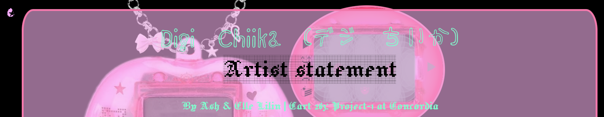
Refer to the [artist statement](assets/img/ScreenShoot/cart263project1.pdf) for more information!!
### Screenshots:
<!-- ([play the game](https://mewmewpewpew.github.io/Project1/) before, don't spoil yourself) -->

<!-- Actions: -->

 
 

  

<!-- Outcomes: -->
 
  
 
 

<!--  -->
 
 

### Project-2 < CART 263 < Concordia 
We intergrated a library called Phaser(3) to add a battle scene to our game - pokemon style! 

#### more screenshots:
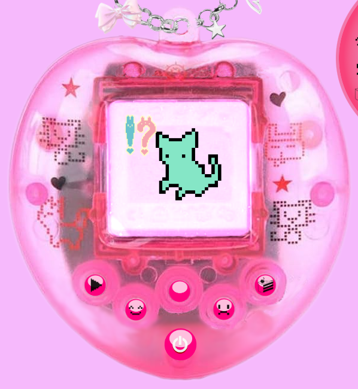
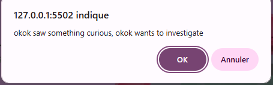
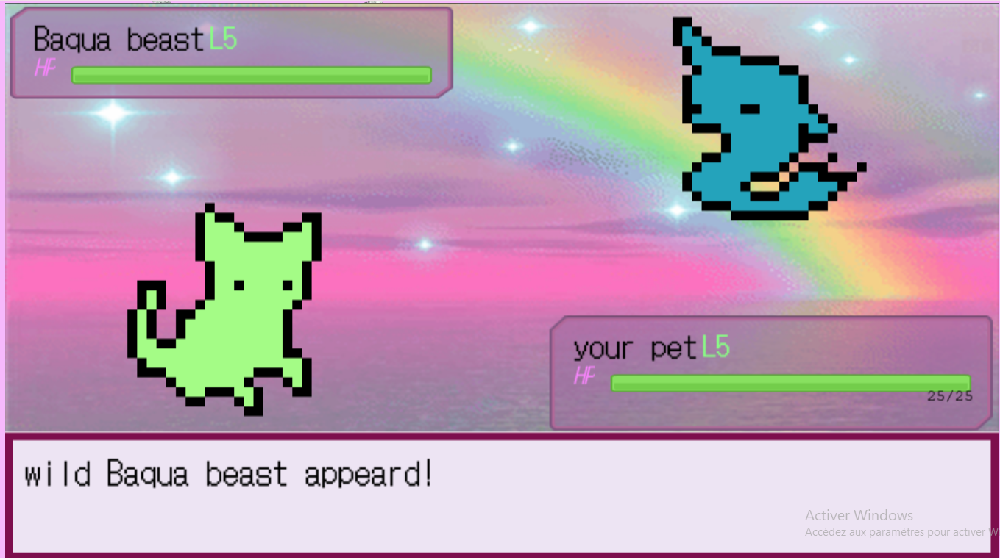
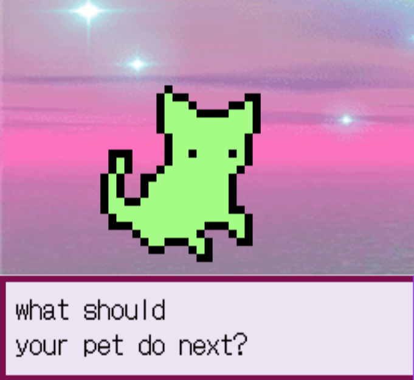
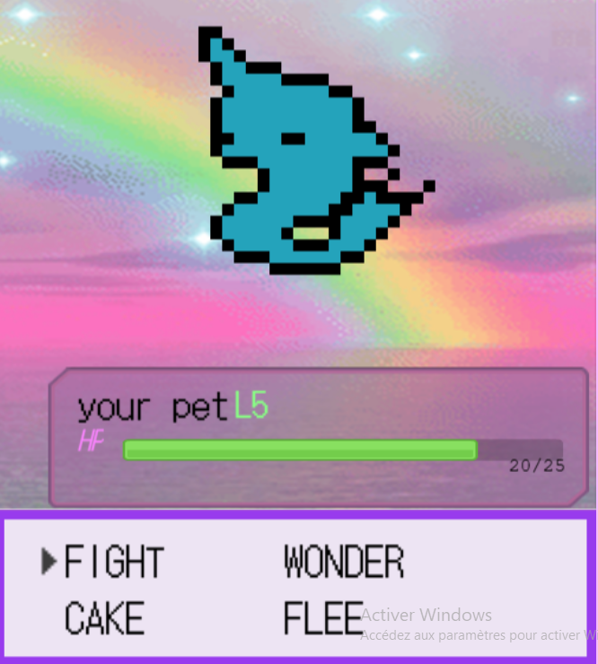
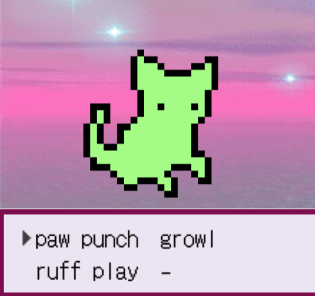
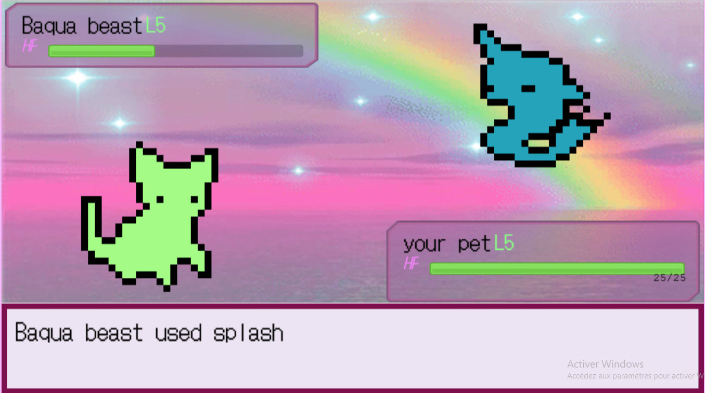
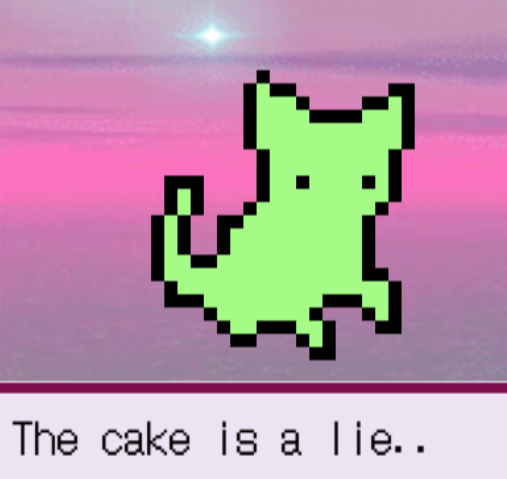
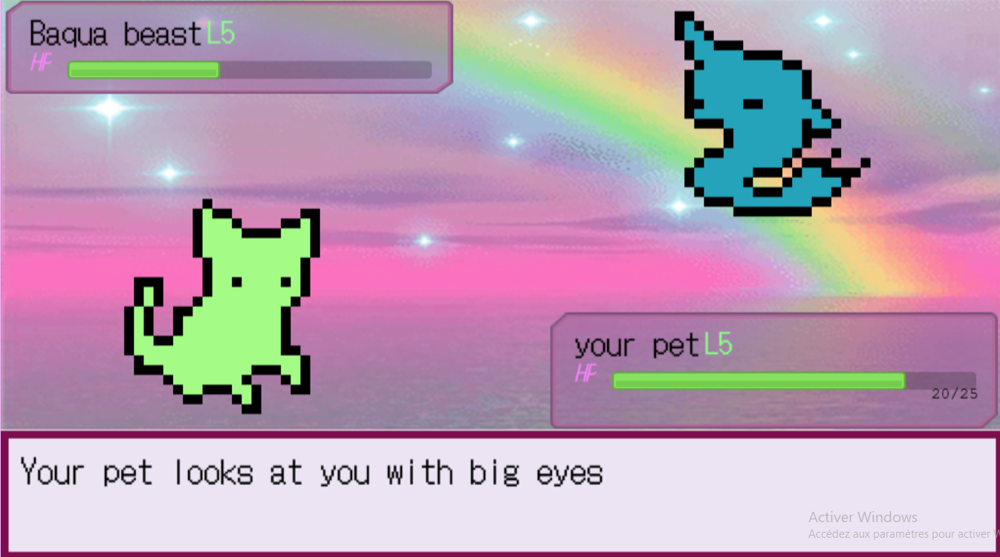
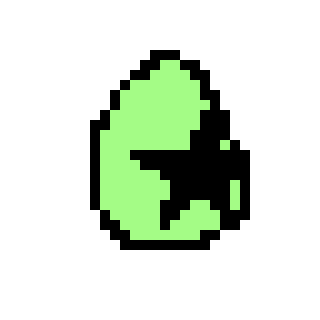 
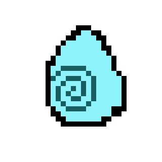
---
### Credits: 
CART 263 class learning material: https://anomalse.github.io/CART263-Winter-2026/projects.html

- ★Martine Neddam, Mouchette.org, 1996. https://www.mouchette.org/ 
- https://tamagotchi.fandom.com/wiki/Tamagotchi_(1996_Pet)  
- ★Brian Mackern, netart latino database, 1999­-2004. https://anthology.rhizome.org/netart-latino-database 
- https://www.piskelapp.com/p/create/sprite/ 
- https://en.wikipedia.org/wiki/The_cake_is_a_lie 
- https://fr.wikipedia.org/wiki/La_Trahison_des_images 
- ★Andrew Badr, About Your World of Text. https://www.yourworldoftext.com/chromeexperiments 
- ★Brian Mackern’s, netart latino database. https://anthology.rhizome.org/netart-latino-database 
- ★Lynn Hershman Leeson’s, The dollie clone series, 1996-1998.  https://anthology.rhizome.org/dollie-clones 
- ★ Resilient Web Design. https://resilientwebdesign.com/ 
- https://en.wikipedia.org/wiki/Tamagotchi_effect

Project2
- Youtube series by Scott Westover, https://www.youtube.com/watch?v=YTEWoLw8GM4&list=PLmcXe0-sfoSgq-pyXrFx0GZjHbvoVUW8t&index=9 
- learning material on phaser by Pippin, [https://pippinbarr.com/cart263-2021/course-information/schedule.html#game-engine](https://pippinbarr.com/cart263-2021/course-information/schedule.html#game-engine)  

About “kawaii”/Japanese studies & ASCII art
- https://utppublishing.com/doi/abs/10.1558/sols.36212 
- https://ir.library.osaka-u.ac.jp/repo/ouka/all/73599/irjs_3_013.pdf
- https://dl.acm.org/doi/pdf/10.1145/1833349.1778789

★
- Music used: “nanana” by Mietze Conte
- Trainer Battle - Pokémon Red/Blue/Yellow Soundtrack: https://www.youtube.com/watch?v=fEWo5q_xy-Q&list=PLNVA15CuezfM-AZLt6IM9Xwk3VGySwn8R&index=2
- Other sound were taken from: Sound Effect by freesound_community from Pixabay

THANKS  <3
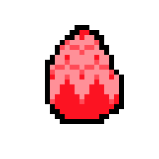
